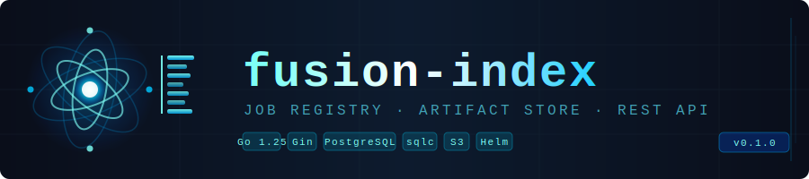

<div align="center">
  
</div>

<br/>

**fusion-index** is the artifact registry of the [Fusion Platform](../). It stores, versions, and exposes binary artifacts and their metadata via a clean REST API. Every model checkpoint, pipeline output, library release, or configuration bundle has a home here.

---

## Overview

```
              Artifact  ──versions──►  Version  ──files──►  File bytes
              (full name)              (semver)              (S3 / filesystem)
                  │                      │
                  │  namespaced name      │  semver + raw config
                  │  org.team.name        │  tags (latest, stable, …)
                  └──────────────────────┘
                       ▲ indexed & queryable via REST API
```

- **Artifacts** are uniquely identified by a Python-style namespaced full name (`org.team.name`).
- **Versions** follow semantic versioning (`major.minor.patch`) and carry an optional raw configuration string (JSON or YAML).
- **Tags** are mutable string pointers to a version — assigning an existing tag moves it atomically.
- **Files** are binary blobs uploaded per version, streamed directly to the storage backend.

---

## Features

- Full CRUD for artifacts and their versions
- Multiple files per version with streaming upload and download (no buffering in memory)
- Mutable tags per artifact (`latest`, `stable`, etc.) with atomic upsert semantics
- Per-version raw configuration string (JSON or YAML, stored as-is)
- Pluggable storage: local filesystem for dev, S3 / S3-compatible (MinIO, Ceph) for production
- Filter artifacts by name prefix or by tag
- Automatic DB migrations at startup via [golang-migrate](https://github.com/golang-migrate/migrate)
- Type-safe DB access generated by [sqlc](https://sqlc.dev/)
- OpenAPI 3.1 spec at `/api/openapi.json`; Swagger UI at `/swagger/`
- Kubernetes-ready: health probes, Helm chart with HPA, Ingress, and secrets management
- Integration tests against a real PostgreSQL container (testcontainers-go)

---

## Quick Start

### Prerequisites

| Tool | Version |
|------|---------|
| Go | 1.25+ |
| PostgreSQL | 15 or 16 |
| Docker | 20+ (for integration tests) |

### Run locally

```bash
# 1. Start PostgreSQL
docker run -d --name pg \
  -e POSTGRES_USER=fusion \
  -e POSTGRES_PASSWORD=fusion \
  -e POSTGRES_DB=fusion_index \
  -p 5432:5432 postgres:16-alpine

# 2. Build and run
go build -o fusion-index ./cmd/server
export DB_PASSWORD=fusion STORAGE_BACKEND=FILESYSTEM
./fusion-index

# 3. Verify
curl -s http://localhost:8080/q/health/ready
# {"status":"UP"}

# 4. Create your first artifact
curl -s -X POST http://localhost:8080/api/v1/artifacts \
  -H "Content-Type: application/json" \
  -d '{"fullName":"org.example.mylib","description":"My first artifact"}' \
  | python3 -m json.tool
```

The server listens on `http://localhost:8080` by default.

### Run integration tests

```bash
go test ./tests/integration/... -timeout 120s
```

Docker must be running — testcontainers-go spins up a real PostgreSQL instance automatically.

---

## Configuration

All configuration is through environment variables.

| Variable | Default | Description |
|----------|---------|-------------|
| `HTTP_PORT` | `8080` | Listen port |
| `DB_HOST` | `localhost` | PostgreSQL host |
| `DB_PORT` | `5432` | PostgreSQL port |
| `DB_NAME` | `fusion_index` | Database name |
| `DB_USERNAME` | `fusion` | DB user |
| `DB_PASSWORD` | `fusion` | DB password |
| `DB_SSLMODE` | `disable` | `disable` / `require` / `verify-full` |
| `STORAGE_BACKEND` | `FILESYSTEM` | `FILESYSTEM` or `S3` |
| `STORAGE_FS_ROOT` | `~/.fusion-index/artifacts` | Root dir for filesystem storage |
| `S3_BUCKET` | `fusion-index-artifacts` | S3 bucket name |
| `AWS_REGION` | `us-east-1` | AWS region |
| `S3_ENDPOINT_OVERRIDE` | _(empty)_ | Custom endpoint for MinIO / Ceph |

---

## Project Layout

```
cmd/server/main.go              # entrypoint
internal/
├── config/config.go            # env-var loading
├── semver/semver.go            # Parse/format major.minor.patch
├── db/
│   ├── queries/                # hand-written SQL (sqlc input)
│   └── sqlc/                   # generated Go — do not edit
├── storage/
│   ├── storage.go              # Storage interface
│   ├── filesystem.go
│   └── s3.go
└── api/
    ├── router.go               # Gin setup + routes
    ├── openapi/                # embedded OpenAPI 3.1 spec + Swagger UI
    ├── handlers/               # one file per resource
    └── dto/                    # request / response structs + mappers
migrations/                     # golang-migrate SQL files
tests/integration/              # real-Postgres integration tests
deployment/                     # Helm chart
```

---

## Documentation

| Document | Contents |
|----------|----------|
| [INSTALL.md](INSTALL.md) | Local dev, Docker, Minikube, and production Helm deployment |
| [API_ARCHITECTURE.md](API_ARCHITECTURE.md) | Request lifecycle, layered architecture, DB schema, storage design |
| [EXAMPLES.md](EXAMPLES.md) | Curl examples for every endpoint |

---

## License

GNU General Public License v3.0 — see [LICENSE](LICENSE).
